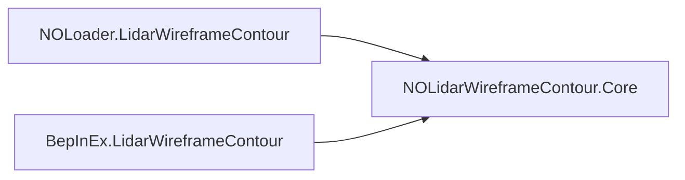

**Developer:** Mursisru

# Lidar Wireframe Contour

[](CHANGELOG.md)
[](https://github.com/Mursisru/NOLidarWireframeContour/releases)
[](https://store.steampowered.com/app/2168680/Nuclear_Option/)
[](https://github.com/Mursisru/NOLoader)
[](https://dotnet.microsoft.com/)
[](LICENSE)

---

## Critical warnings
> [!CAUTION]
> **Never install NOLoader and BepInEx builds together** - double URP post-process hook will break or duplicate the wireframe effect.

> [!IMPORTANT]
> - **Pick one loader** - NOLoader path **or** BepInEx 5 + Configuration Manager; do not mix payloads in one game folder.
> - **Close the game before NOLoader deploy** - PatchTool needs unlocked `Managed\*.dll`.
> - **Ship Core DLL and shader data** - both `NOLidarWireframeContour.Core.dll` and `NOLidarWireframeContour_Data/lidar_shaders` are required; plugin-only install fails (`gpu=False`).

> [!WARNING]
> - **`lidar_shaders` bundle must be valid (>= 15 KB)** - stale or missing bundle causes `gpu=False` and no wireframe.
> - **Mission stage only** - mod `loadStage` is `Mission`; no probe chain in main menu.
> - **BepInEx builds <= 0.3.4 may load but never tick** - use **0.3.5V+** with `LidarWireframeHost` on a `DontDestroyOnLoad` GameObject.

> [!NOTE]
> **Do not run alongside TerrainSilhouetteHud for the same role** - pick one terrain-warning approach.

> [!TIP]
> **Force-night override:** press **Y** (still requires TTI <= 7 s toward terrain).

GPU lidar terrain wireframe for **[Nuclear Option](https://store.steampowered.com/app/2168680/Nuclear_Option/)** — velocity-aligned collision cone, TTI-driven activation, URP post-process compositing.

**Pick one loader** — NOLoader **or** BepInEx. Do not install both (double URP hook).

| Loader | Install path | Configuration |
|--------|--------------|---------------|
| **[NOLoader](https://github.com/Mursisru/NOLoader)** | `NOLoader\mods\LidarWireframeContour\` | `mod_config.ini` (hot-reload) |
| **BepInEx 5** + [Configuration Manager](https://github.com/BepInEx/BepInEx.ConfigurationManager) | `BepInEx\plugins\` | **F1** in-game |

> **Versions:** logs show `0.3.6V` · assemblies / `mod.json` / `[BepInPlugin]` use semver **`0.3.6`**

## Table of contents

- [Critical warnings](#critical-warnings)
- [Features](#features)
- [Requirements](#requirements)
- [Quick install](#quick-install)
- [Documentation](#documentation)
- [Quick start (pilots)](#quick-start-pilots)
- [Build (developers)](#build-developers)
- [Repository layout](#repository-layout)
- [Architecture overview](#architecture-overview)
- [Configuration summary](#configuration-summary)
- [Versioning](#versioning)
- [Changelog](#changelog)
- [Related projects](#related-projects)
- [License](#license)

---

## Features

| Area | Behavior |
|------|----------|
| **Probe** | Dual-radius `Physics.SphereCast` along **velocity** (wind-drift aware) |
| **Rates** | 5 Hz cruise · **20 Hz** near TTI (`ProbeIntervalNearSec=0.05`) |
| **Auto** | Night + gear up + TTI ≤ 7 s |
| **Static off** | Daytime **or** gear deployed → no auto |
| **Force night** | **`Y`** toggles override (ignores day/gear); TTI ≤ 7 s still required |
| **Escape hold** | **1 s** continued display after pulling away (`HoldAfterEscapeSec`) |
| **GPU** | Full-res R32 depth + Laplacian edge @ 60 Hz · backbuffer composite |
| **Fade** | Shader-time fade via `_CombatStartTime` / `_CombatEndTime` + `_Time.y` |
| **Cone** | Smoothed at render rate (`VisualUpdate`) |
| **HUD** | Tactical green wireframe, static CRT scanlines |
| **CPU** | Probe on 5/20 Hz timer; fade/hold via loader tick (NOLoader `INOModTickNormal` or BepInEx host `Update`) |

---

## Requirements

- [Nuclear Option](https://store.steampowered.com/app/2168680/Nuclear_Option/) (Steam)
- **NOLoader:** [NOLoader](https://github.com/Mursisru/NOLoader) + PatchTool applied once
- **BepInEx:** [BepInEx 5](https://docs.bepinex.dev/) + [Configuration Manager](https://github.com/BepInEx/BepInEx.ConfigurationManager)
- .NET Framework 4.8 SDK (build only)
- Unity **2022.3 LTS** (shader bundle build only)

---

## Quick install

Download from **[GitHub Releases](https://github.com/Mursisru/NOLidarWireframeContour/releases)**:

| Artifact | Extract to |
|----------|------------|
| `NOLidarWireframeContour-NOLoader-v0.3.6.zip` | `Nuclear Option\` (creates `NOLoader\mods\LidarWireframeContour\`) |
| `NOLidarWireframeContour-BepInEx-v0.3.6.zip` | `Nuclear Option\` (creates `BepInEx\plugins\` payload) |

Both packages include **`NOLidarWireframeContour.Core.dll`** and **`NOLidarWireframeContour_Data/lidar_shaders`**.

Detailed steps: **[docs/INSTALL.md](docs/INSTALL.md)**

---

## Documentation

| Document | Contents |
|----------|----------|
| [docs/INSTALL.md](docs/INSTALL.md) | NOLoader vs BepInEx install, folder layout, verify |
| [docs/ARCHITECTURE.md](docs/ARCHITECTURE.md) | Solution structure, tick map, BepInEx host lifecycle |
| [docs/CONFIGURATION.md](docs/CONFIGURATION.md) | All 43 settings + CM sections + debug ladder |
| [docs/TROUBLESHOOTING.md](docs/TROUBLESHOOTING.md) | `gpu=False`, missing bundle, dual-loader, Vulkan notes |
| [BUILD_SHADER_BUNDLE.md](NOLidarWireframeContour_Data/BUILD_SHADER_BUNDLE.md) | Unity AssetBundle build |

---

## Quick start (pilots)

1. Cockpit view · speed **> 30 m/s** · AGL **< 500 m**
2. Night mission (or press **Y** for force-night)
3. Dive toward terrain — at **TTI ≤ 7 s** the wireframe cone appears
4. Pull up — effect holds **~1 s** then fades out

---

## Build (developers)

```powershell
.\scripts\build-shader-bundle.ps1   # optional if bundle exists
dotnet build NOLidarWireframeContour.sln -c Release
```

Deploy scripts (local dev only — **not** required for release zip install):

```powershell
.\scripts\deploy-mod.ps1       # NOLoader → game mods folder
.\scripts\deploy-bepinex.ps1   # BepInEx → plugins folder
```

Close Nuclear Option before NOLoader deploy (PatchTool needs unlocked `Managed\*.dll`).

---

## Repository layout

```
NOLidarWireframeContour/
├── NOLidarWireframeContour.Core/       # Shared runtime
├── NOLoader.LidarWireframeContour/     # NOLoader wrapper
├── BepInEx.LidarWireframeContour/      # BepInEx plugin
├── NOLidarWireframeContour_Data/       # Shader sources + bundle output
├── UnityBundleBuilder/                 # Unity 2022.3 bundle project
├── scripts/                            # build-shader-bundle, deploy-*
└── docs/                               # Install, architecture, config, troubleshooting
```

---

## Architecture overview



Shared probe + URP passes live in **Core**. Loaders differ only in config source, patch application, and CPU tick entry.

**BepInEx (0.3.5V+):** `LidarWireframeHost` on a `DontDestroyOnLoad` GameObject — the plugin `GameObject` does not receive `Update`. Harmony and GPU init run on **mission** scene load.

Full diagrams and tick table: **[docs/ARCHITECTURE.md](docs/ARCHITECTURE.md)**

### Key types

| Component | Role |
|-----------|------|
| `ACT_LidarCollisionController` | Probe, TTI gate, hold, uniforms |
| `LidarPostProcess` | URP hook · GPU gate |
| `LidarDepthCapturePass` / `LidarWireframeRenderPass` | Depth + composite |
| `LidarWireframeMod` | NOLoader `INOMod` entry |
| `LidarWireframeBepInPlugin` / `LidarWireframeHost` | BepInEx entry + tick |

---

## Configuration summary

| NOLoader | BepInEx |
|----------|---------|
| `mod_config.ini` `[Lidar]` | **F1** → General / Probe / Activation / Fade / Visual / Debug |

Core keys: `TtiActivateSec=7`, `ProbeIntervalSec=0.2`, `ProbeIntervalNearSec=0.05`, `ForceHotkeyBinding=Y`.

Full reference (43 keys): **[docs/CONFIGURATION.md](docs/CONFIGURATION.md)**

---

## Versioning

| Context | Format | Example |
|---------|--------|---------|
| `mod.json`, assembly, release tag, `[BepInPlugin]` | numeric semver | `0.3.6` |
| Logs, `DisplayVersion`, CHANGELOG | semver + suffix | `0.3.6V` |

Suffix letters: **V** visual · **M** mechanic · **P** program · **A** audio · **Q** QoL · **O** other.  
`Q` and `M` must not appear in the same version string.

---

## Changelog

See **[CHANGELOG.md](CHANGELOG.md)** — `0.1.0` legacy DEV builds → **`0.3.6V`**.

---

## Related projects

| Project | Relation |
|---------|----------|
| [NOLoader](https://github.com/Mursisru/NOLoader) | NOLoader install path |
| [BepInEx](https://docs.bepinex.dev/) | Alternative loader |
| [NOAviationCareerTracker](https://github.com/at747/NOAviationCareerTracker) | ACT naming only — no hard dependency |
| [TerrainSilhouetteHud](https://github.com/at747/TerrainSilhouetteHud_Engine) | Alternative HUD — do not run both for same role |

---

## License

[MIT](LICENSE) — Copyright (c) 2026 [Mursisru](https://github.com/Mursisru)

## Author

**[Mursisru](https://github.com/Mursisru)** — Nuclear Option modding

---

## Keywords

nuclear-option, noloader, mod, nolidarwireframecontour, csharp, unity
