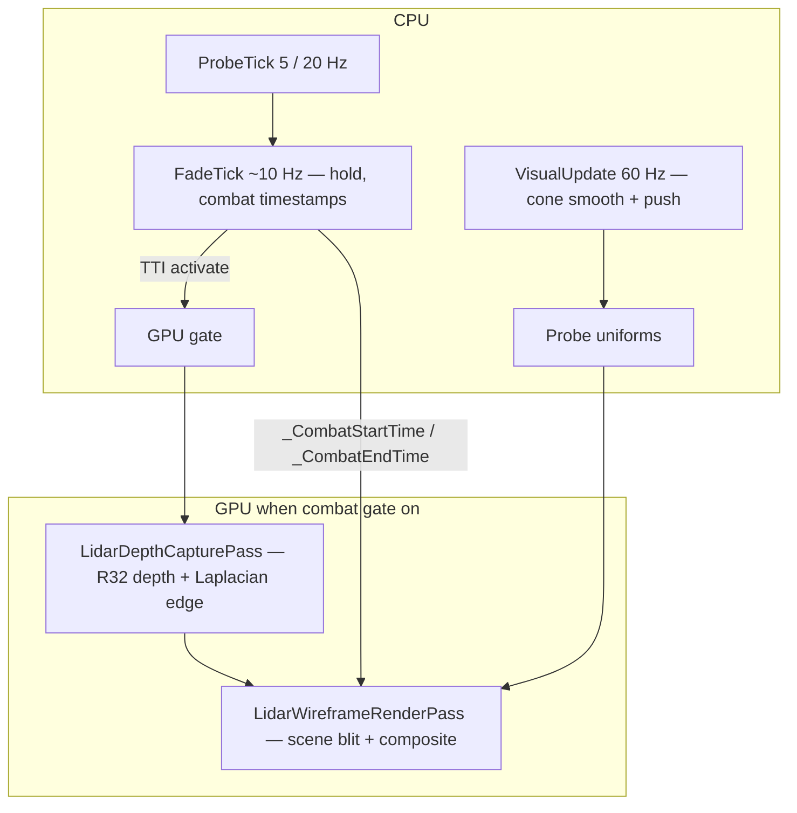

# Lidar Wireframe Contour

[](CHANGELOG.md)
[](https://github.com/Mursisru/NOLidarWireframeContour/releases)
[](https://store.steampowered.com/app/2168680/Nuclear_Option/)
[](https://github.com/Mursisru/NOLoader)
[](https://dotnet.microsoft.com/)
[](LICENSE)

Standalone **[NOLoader](https://github.com/Mursisru/NOLoader)** mod for **[Nuclear Option](https://store.steampowered.com/app/2168680/Nuclear_Option/)**: GPU lidar terrain wireframe with velocity-aligned collision cone, TTI-driven activation, and URP post-process compositing.

> **Display version:** `0.3.3V` in logs · **semver** `0.3.1` in `mod.json` / assembly

---

## Features

| Area | Behavior |
|------|----------|
| **Probe** | Dual-radius `Physics.SphereCast` along **velocity** (wind-drift aware) |
| **Rates** | 5 Hz cruise · **20 Hz** near TTI (`ProbeIntervalNearSec=0.05`) |
| **Auto** | Night + gear up + TTI ≤ 7 s |
| **Static off** | Daytime **or** gear deployed → no auto |
| **Force night** | **`Y`** toggles override (ignores day/gear); TTI ≤ 7 s still required |
| **Escape hold** | **1 s** continued display after pulling away (`HoldAfterEscapeSec`) |
| **GPU** | Full-res R32 depth + Laplacian edge @ 60 Hz · backbuffer composite |
| **Fade** | Shader-time fade via `_CombatStartTime` / `_CombatEndTime` + `_Time.y` (no CPU blend stutter) |
| **Cone** | Smoothed at **render rate** (`VisualUpdate`) — no ~10 Hz teleport |
| **HUD** | Tactical green, static CRT scanlines (no temporal noise flicker) |
| **CPU** | No `Update()` on probe path — `INOModTickNormal` + render hook |

---

## Requirements

- [Nuclear Option](https://store.steampowered.com/app/2168680/Nuclear_Option/) (Steam)
- [NOLoader](https://github.com/Mursisru/NOLoader) installed and PatchTool applied
- .NET Framework 4.8 SDK (build only)
- Unity **2022.3 LTS** (shader bundle build only)

---

## Install (players)

1. Copy folder `LidarWireframeContour` to  
   `Nuclear Option\NOLoader\mods\`
2. Run NOLoader **PatchTool** once so `FlightHud` Harmony patches apply.
3. Confirm `NOLidarWireframeContour_Data\lidar_shaders` exists (~20 KB bundle).

Or use a [GitHub release](https://github.com/Mursisru/NOLidarWireframeContour/releases) artifact if published.

---

## Quick start (pilots)

1. Cockpit view · speed **&gt; 30 m/s** · AGL **&lt; 500 m**
2. Dive toward terrain — at **TTI ≤ 7 s** the wireframe cone appears
3. Pull up — effect stays **~1 s** then fades out smoothly

---

## Build & deploy

```powershell
# From repo root — closes game check inside script
.\scripts\deploy-mod.ps1
```

Manual build:

```powershell
dotnet build NOLoader.LidarWireframeContour\NOLoader.LidarWireframeContour.csproj -c Release
.\scripts\build-shader-bundle.ps1
```

**Close Nuclear Option** before deploy (PatchTool needs unlocked `Managed\*.dll`).

Deploy target: `Nuclear Option\NOLoader\mods\LidarWireframeContour\`

---

## Shader asset bundle

Runtime loads **`lidar_shaders`** (AssetBundle) only — loose `.shader` files are source/build inputs.

```powershell
.\scripts\build-shader-bundle.ps1
```

See [NOLidarWireframeContour_Data/BUILD_SHADER_BUNDLE.md](NOLidarWireframeContour_Data/BUILD_SHADER_BUNDLE.md).

---

## Architecture



### Tick map

| Hz | Component | Role |
|----|-----------|------|
| **60** | `LidarDepthCapturePass` | R32 depth copy + full-res Laplacian edge |
| **60** | `LidarWireframeRenderPass` | Scene copy + composite fullscreen |
| **60** | Composite shader `_Time.y` | Fade-in / fade-out visibility |
| **60** | `VisualUpdate` | Cone direction & distance smoothing |
| **20** | `ProbeTick` (near) | SphereCast + TTI, `_wantsActive` |
| **5** | `ProbeTick` (cruise) | SphereCast far from threshold |
| **~10** | `INOModTickNormal` | Hold timer, combat GPU gate, probe accumulator |
| **1** | Config reload | `mod_config.ini` hot-reload |

### Key types

| File | Purpose |
|------|---------|
| `LidarWireframeMod` | NOLoader entry · `INOModTickNormal` |
| `ACT_LidarCollisionController` | Probe, TTI gate, hold, uniform targets |
| `LidarPostProcess` | URP hook · GPU gate · depth policy |
| `LidarDepthCapturePass` | Depth + edge precompute |
| `LidarWireframeRenderPass` | Backbuffer composite |
| `LidarShaderAssets` | Bundle load `lidar_shaders` |

---

## Configuration

Edit `mod_config.ini` in the mod folder (hot-reload ~1 s).

### Core

| Key | Default | Description |
|-----|---------|-------------|
| `Enabled` | `true` | Master switch |
| `TtiActivateSec` | `7.0` | Activate below this TTI (seconds) |
| `ProbeIntervalSec` | `0.2` | Probe interval cruise (5 Hz) |
| `ProbeIntervalNearSec` | `0.05` | Probe interval near TTI (20 Hz) |
| `HoldAfterEscapeSec` | `1.0` | Keep effect 1 s after leaving collision threat |
| `MinSpeedMps` | `30` | Minimum speed for lidar |
| `SafeAglMeters` | `500` | Disable above this AGL |
| `BlockWhenGearDeployed` | `true` | No auto-activation with landing gear down |
| `BlockDuringDaytime` | `true` | No auto-activation during day hours |
| `DaytimeStartHour` | `6` | Day begins (in-game hour, 0–24) |
| `DaytimeEndHour` | `18` | Day ends (in-game hour) |
| `ForceHotkeyEnabled` | `true` | Enable manual toggle hotkey |
| `ForceHotkeyBinding` | `Y` | Physical `KeyCode.Y` (layout-independent) |

### Fade (shader-driven)

| Key | Default | Description |
|-----|---------|-------------|
| `FadeInSec` | `0.3` | Shader fade-in duration |
| `FadeInUrgentSec` | `0.12` | Faster fade when TTI already low |
| `FadeOutSec` | `0.3` | Shader fade-out after hold ends |
| `UniformSmoothSec` | `0.32` | Cone / distance smoothing time constant |

### Cast & cone

| Key | Default | Description |
|-----|---------|-------------|
| `CastMaxDistanceM` | `1500` | Max cast range |
| `CastRadiusNearM` | `2` | Near SphereCast radius |
| `CastRadiusFarM` | `50` | Far SphereCast radius |
| `ConeHalfAngleDeg` | `15` | Velocity cone half-angle |
| `ConeFalloffCos` | `0.05` | Cone edge softness (cosine space) |
| `TerrainLayerMask` | `2112` | Physics layers for terrain |

### Visual / edge

| Key | Default | Description |
|-----|---------|-------------|
| `LidarColorHex` | `#00CC66` | Wireframe tint |
| `HudBrightness` | `0.62` | HUD intensity multiplier |
| `EdgeThreshold` | `0.20` | Laplacian threshold (depth-scaled) |
| `EdgeStrength` | `1.6` | Edge intensity |
| `EdgeThinPow` | `4.2` | Line thinning exponent |
| `EdgeTexelScale` | `0.50` | Depth sample stride |
| `DistanceFadeMeters` | `175` | Soft range fade before max distance |
| `NoiseStrength` | `0.15` | Legacy CRT noise (unused in 0.2.5V+ shader) |

### Debug & GPU

| Key | Default | Description |
|-----|---------|-------------|
| `ForceKeepDepthTextureActive` | `false` | Pin URP depth texture (debug stutter trade-off) |
| `DebugForceBlend` | `0` | Force combat GPU path (isolation test) |
| `DebugShaderMode` | `0` | Shader debug ladder (see below) |
| `DebugLogVerbose` | `false` | Agent debug log file |
| `OutputCameraName` | *(empty)* | Composite camera override (default: main) |

### Debug bisect ladder

| Step | Settings | Expected |
|------|----------|----------|
| 1 | default | Log: `[LidarWireframe] 0.3.3V loaded`, `gpu:true`, `bundleBytes>15000` |
| 2 | `DebugForceBlend=1`, `DebugShaderMode=5` | Full green screen |
| 3 | `DebugShaderMode=6` | White terrain lines |
| 4 | `DebugShaderMode=4` | Grayscale depth |
| 5 | `DebugForceBlend=0`, `DebugShaderMode=3` | Green contour overlay |
| 6 | `DebugShaderMode=0` | Combat lidar at TTI ≤ 7 s |

---

## Versioning

| Context | Format | Example |
|---------|--------|---------|
| `mod.json`, assembly, GitHub **release tag** | numeric semver | `0.3.3` |
| Logs, `DisplayVersion`, CHANGELOG | semver + suffix | `0.3.3V` |

Suffix letters: **V** visual · **M** mechanic · **P** program · **A** audio · **Q** QoL · **O** other.  
`Q` + `M` must not appear in the same version string.

---

## Changelog

See [CHANGELOG.md](CHANGELOG.md) for full history (`0.1.0` legacy DEV builds → `0.3.3V`).

---

## Related projects

| Project | Relation |
|---------|----------|
| [NOLoader](https://github.com/Mursisru/NOLoader) | Required loader |
| [NOAviationCareerTracker](https://github.com/at747/NOAviationCareerTracker) | ACT naming only — no hard dependency |
| [TerrainSilhouetteHud](https://github.com/at747/TerrainSilhouetteHud_Engine) | Alternative HUD — do not run both for same role |

---

## License

[MIT](LICENSE) — Copyright (c) 2026 [Mursisru](https://github.com/Mursisru)

## Author

**[Mursisru](https://github.com/Mursisru)** — Nuclear Option modding
