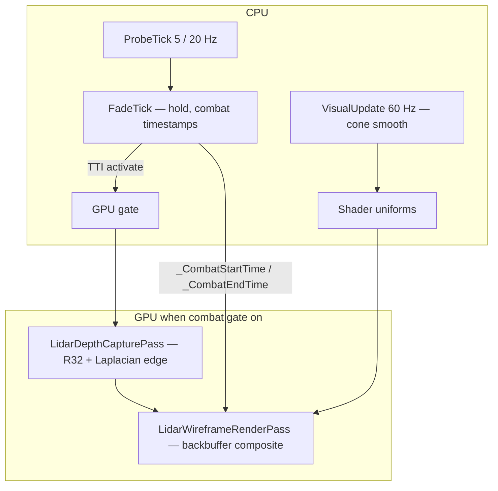

# Architecture

Shared GPU lidar runtime with two thin loader entry points.

---

## Solution layout

```
NOLidarWireframeContour.sln
├── NOLidarWireframeContour.Core          # Shared runtime (probe, URP, gates, config)
├── NOLoader.LidarWireframeContour        # NOLoader wrapper (mod.json, ini, patches)
└── BepInEx.LidarWireframeContour       # BepInEx plugin (Harmony, CM, host tick)
```

| Assembly | Role |
|----------|------|
| `NOLidarWireframeContour.Core.dll` | **Required at runtime** for both loaders |
| `NOLoader.LidarWireframeContour.dll` | NOLoader `INOMod` entry + PatchTool patch targets |
| `BepInEx.LidarWireframeContour.dll` | `[BepInPlugin]` + `LidarWireframeHost` lifecycle |

`InternalsVisibleTo` on Core exposes internals to both loader assemblies.

Namespace for BepInEx code: `LidarWireframeContour.BepInEx` (avoids shadowing the `BepInEx` root namespace).

---

## Loader comparison

| Aspect | NOLoader | BepInEx |
|--------|----------|---------|
| Entry | `LidarWireframeMod` (`INOMod`) | `LidarWireframeBepInPlugin` |
| Load timing | `loadStage: Mission` in `mod.json` | Mission scene via `SceneManager.sceneLoaded` |
| Config | `mod_config.ini` hot-reload | Configuration Manager (**F1**) |
| Patches | PatchTool manifest in `mod.json` | Harmony `PatchAll` on mission start |
| CPU fade / hold tick | `INOModTickNormal` (~10 Hz) | `LidarWireframeHost.Update` (~60 Hz, same logic) |
| Probe tick | `INOModTickNormal` accumulator | Same accumulator in host `Update` |
| GPU init | On mod mission load | Deferred to first mission scene load |

**Do not run both** — each registers URP render passes on the same pipeline.

---

## BepInEx host lifecycle (0.3.5V+)

`BaseUnityPlugin` attaches to a short-lived bootstrap `GameObject` that **does not receive `Update`** reliably.

```
Awake (plugin)
  └── Create DontDestroyOnLoad "LidarWireframe.Host"
        └── LidarWireframeHost component
              ├── sceneLoaded → Harmony + LidarPostProcess.Init on Mission
              └── Update → FadeTick + ProbeTick
```

Pattern matches other Nuclear Option BepInEx mods (e.g. MissileCamera): mission-gated init, persistent host for tick.

---

## Data flow



---

## Tick map

| Rate | Component | Role |
|------|-----------|------|
| **60 Hz** | `LidarDepthCapturePass` | R32 depth copy + full-res Laplacian edge |
| **60 Hz** | `LidarWireframeRenderPass` | Scene blit + fullscreen composite |
| **60 Hz** | Composite shader `_Time.y` | Shader-driven fade in/out |
| **60 Hz** | `VisualUpdate` | Cone direction & distance smoothing |
| **20 Hz** | `ProbeTick` (near TTI) | SphereCast + TTI, `_wantsActive` |
| **5 Hz** | `ProbeTick` (cruise) | Far-from-threshold probing |
| **~10 Hz** | `FadeTick` (NOLoader: `INOModTickNormal`) | Hold timer, GPU gate, probe interval accumulator |
| **~60 Hz** | `FadeTick` (BepInEx: host `Update`) | Same logic, runs every frame with internal throttling |
| **1 Hz** | Config reload (NOLoader only) | `mod_config.ini` re-read |

Probe path avoids per-frame heap allocation where possible; render hooks run at camera rate.

---

## Key types (Core)

| Type | Responsibility |
|------|----------------|
| `ACT_LidarCollisionController` | Dual SphereCast probe, TTI gate, escape hold, uniform targets |
| `LidarSphereCastProbe` | Cast #1 / #2 with origin offset, terrain mask |
| `LidarPostProcess` | URP feature hook, GPU gate, depth texture policy |
| `LidarDepthCapturePass` | Owned R32 depth RT + edge precompute |
| `LidarWireframeRenderPass` | Backbuffer fullscreen composite |
| `LidarShaderAssets` | Load `lidar_shaders` AssetBundle |
| `LidarConfig` / `LidarSettingsSnapshot` | Runtime settings + apply from ini or BepInEx |

---

## Activation model (0.3.3V+)

| Condition | Auto-activation |
|-----------|-----------------|
| Landing gear deployed | Blocked (`BlockWhenGearDeployed`) |
| Daytime (in-game hours) | Blocked (`BlockDuringDaytime`) |
| Night + gear up + TTI ≤ `TtiActivateSec` | **On** |
| Force-night hotkey (**Y**) | Ignores gear/day; still requires TTI ≤ threshold |
| Escape after threat | **Hold** `HoldAfterEscapeSec` then shader fade-out |

---

## Shader bundle

Runtime loads **only** `NOLidarWireframeContour_Data/lidar_shaders` (Unity AssetBundle).  
Loose `.shader` files under `Shaders/` are build inputs — see [BUILD_SHADER_BUNDLE.md](../NOLidarWireframeContour_Data/BUILD_SHADER_BUNDLE.md).

| Shader | Role |
|--------|------|
| `LidarWireframeContour.shader` | Composite post-process (cone, fade, HUD) |
| `LidarDepthEdge.shader` | Laplacian edge pre-pass |
| `LidarWireframeContour.mat` | Bundle material reference |

Depth uses **R32 float** capture (not 8-bit packed depth) for far-range edges.

---

## Identifiers

| Item | Value |
|------|-------|
| NOLoader `mod.json` id | `com.mursisru.lidarwireframecontour` |
| BepInEx plugin GUID | `com.mursisru.lidarwireframecontour.bepinex` |
| Harmony id | Same as BepInEx GUID |

---

## Build references

- Game API from Nuclear Option `Assembly-CSharp` (local reference in `.csproj`)
- BepInEx libs: game `BepInEx\core` or fallback in `Directory.Build.props`
- Target: **.NET Framework 4.8**
